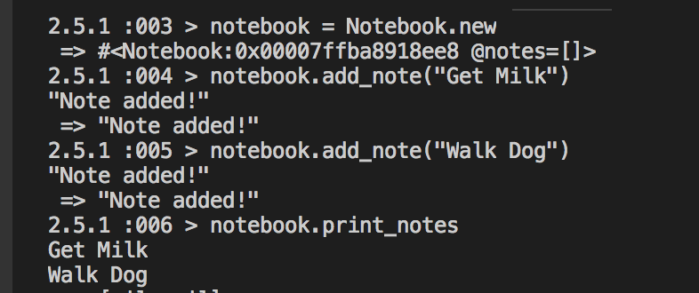
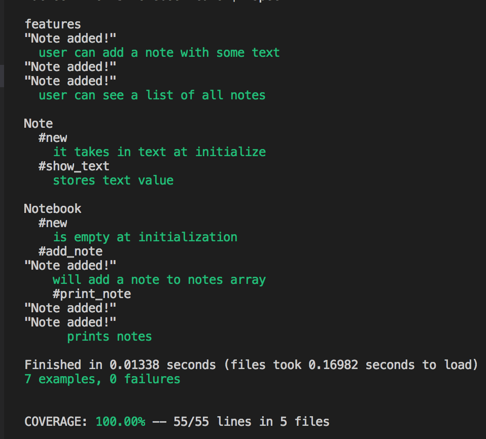

# Notes App
This simple app allows the user to:

* Create a text note
* View the titles of the notes currently stored in the app
* This exercise was completely test driven

## QuickStart
* `git clone https://github.com/CazaBelle/notebook-ruby.git`
* `cd notebook-ruby`
* `bundle install`
* `irb`
* `require lib/notebook.rb`

## Demo

## Tests
* `rspec`

